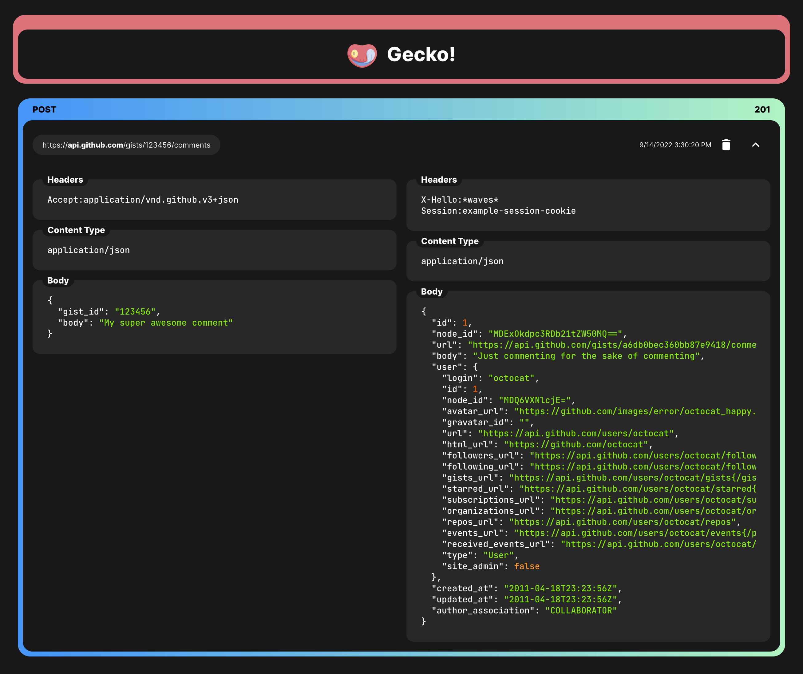

  

<h1 align="center">Gecko Frontend</h1>

Oh where am I hosted? [:)](https://diareuse.github.io/gecko/)

### Feature Set

- [x] Fully offline
- [x] Automatically saves opened links
- [x] Work with every major browser
- [x] Handles parsing multiple links (when copied over from Logcat too!)
- [ ] Can replay requests